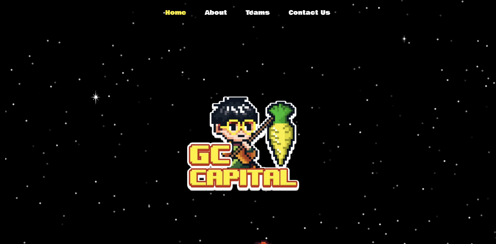

[](https://lunanezha.com/)
[](www.linkedin.com/in/luna-nezha/)

# **GC Capital Framer**

GC Capital Framer is a modern and visually engaging website prototype. It’s designed to showcase financial services and attract clients with clean layouts, and responsive design.



## 🛠 **Features**

- 🔍 Dynamic UI: Eye-catching and user-friendly interface.
- 📱 Responsive Design: Perfectly adapts to mobile, tablet, and desktop.
- ⚡ Framer Animations: Smooth and interactive animations for better user engagement.
- 🖼️ Customizable Components: Easily tweak content and styles to fit your needs.

## **💻 Tech Stack**

- **React**: Component-based UI framework.
- **Next.js**: A React framework for building fast, server-rendered web applications.
- **TailwindCSS**: Utility-first CSS framework.
- **TypeScript**: Static type checking for JavaScript.
- **HeadlessUI**: Unstyled, accessible UI components tailored for TailwindCSS.
- \*_PostCSS_: A tool for transforming CSS with JavaScript plugins.

## 🚀 **Run Locally**

Clone the project

```bash
  git clone https://github.com/LunaNezha/gc-capital-framer
```

Go to the project directory

```bash
  cd gc-capital-framer
```

Install dependencies

```bash
  npm install
```

Start the server

```bash
  npm run dev
```

## ✅ **Running Tests**

To run tests, run the following command

```bash
  npm run test
```

## 🤝 **Contributing**

Contributions are always welcome!

If you’d like to improve this project:

- Fork the repository.
- Create your branch: git checkout -b feature/your-feature.
- Commit your changes: git commit -m "Add your message".
- Push to the branch: git push origin feature/your-feature.
- Open a Pull Request.

## 💡 **Support**

For support, email mahdie.nezhadhosseini@gmail.com.

## 📝 **License**

This project is licensed under the
[MIT](https://choosealicense.com/licenses/mit/) License. See the LICENSE file for details.
